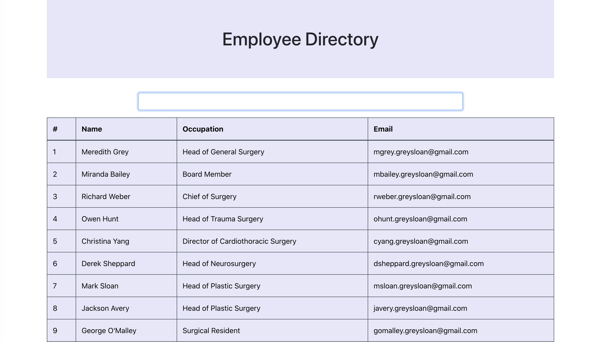
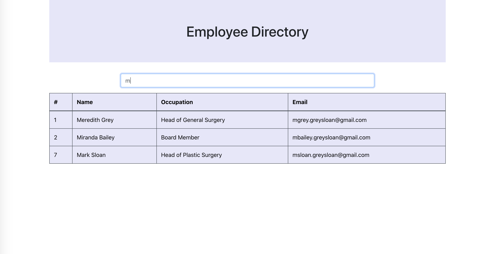

# employee-directory

  ## Description
  For the assignment, I had to create a employee directory with React. I had to break up my application's UI into components, manage component state, and respond to user events

   

   
    Here's a snapshot of the app utilizing the filter feature
  ## Table of Contents

  * [Installation](#Installation)
  * [Usage](#usage)
  * [License](#License)
  * [Link](#Link)
  * [Questions](#Questions)

  ## Installation

  npm i

  ## Usage
  enjoy

  ## License

## Link
[Click Here to see the deployed site!](https://limitless-lowlands-45268.herokuapp.com/)

  ## Questions
  If you have any questions, please contact me on [GitHub](http://github.com/oksimone), Or, email me at ksworthy22@gmail.com
